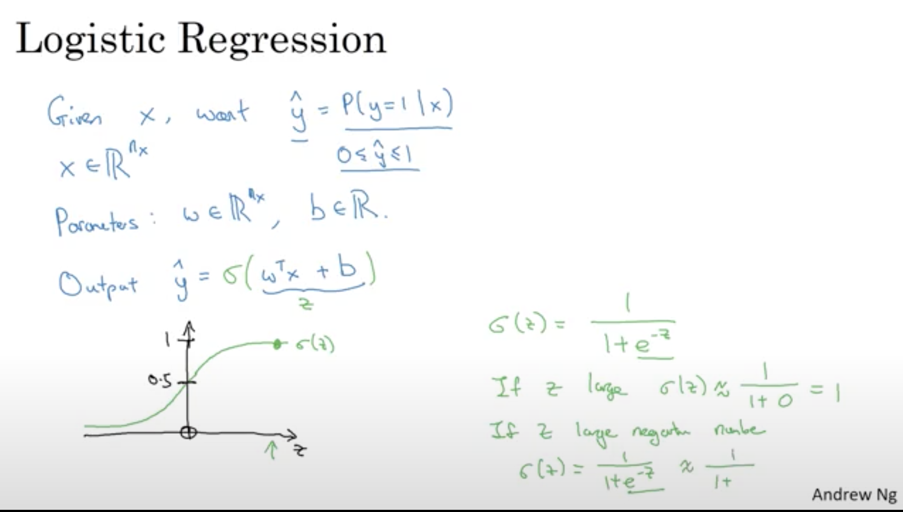
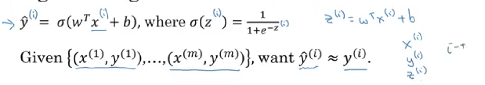
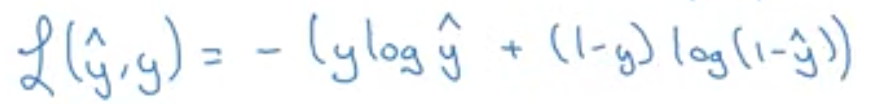
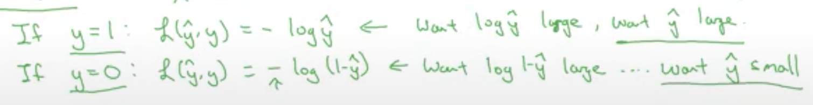
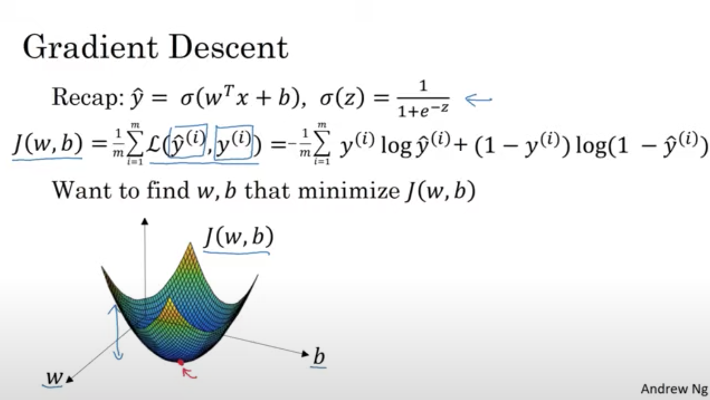
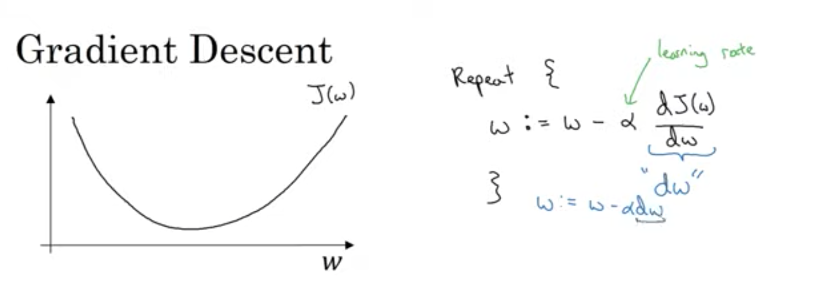
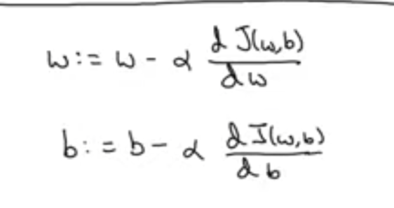

# 2주차 예습

## 기초 선형대수

### 행렬 (matrix)

- 하나이상의 식을 사각형의 배열로 나열
- 행: 가로줄
- 열: 세로줄

### 행렬의 shape

- A라는 행렬이 행이 m 열이 n개
  - A의 shape = (m,n) = m X n

```
[1, 2, 3]
[1, 0,-1]
[4, 5, 6]
[-3,-4,-5]
```
- 행이 4개
- 열이 3개
- 행렬의 shape : (4,3)
- 0은 몇번째 행과 몇번째 열에 있나요? : 2번째행 2번째열

### 행렬 곱

```
[a  b  c]     [A  B]
[d  e  f]  x  [C  D]
              [E  F]
```
위 곱을 진행하면
```
[aA+bC+CE   aB+bD+cF]
[dA+eC+fE   dB+eD+fF]
```
- (2,3) * (3,2) = (2,2)
  - (2,X) * (X,2) = (2,2)
- 곱셈에서 앞의 행렬의 `열`과 뒤의 행렬의 `행`이 같아야 성립
- 결과로는 앞의 행렬의 `행`과 뒤의 행렬의 `열`이 결과의 `행``열`로 이루어짐

#### 예제

```
[1, 2,  3]      [-1, 1]
[1, 0, -1]   X  [3 , 2]
[4, 5,  6]      [-2, 5]
```
- A의 shape : (3,3)
- B의 shape : (3,2)
- A의 열 3 = B의 행 3 이므로 연산가능
- 결과 shape 은 (3,2)

```
[-1, 20]
[1 , -4]
[-1, 44]
```

### 전치행렬 (Transpose)

- a(i,j)를 a(j,i) 로 교환하여 얻은 행렬
- 표기 : A^T
- shape의 변화 = (m,n) -> (n,m)
- A^T^T = A

#### 예제

```
[-1, 1]
[3 , 2]
[-2, 5]
```
- A의 shape = (3,2)
- A transpose 의 shape = (2,3)
```
[-1,3,-2]
[1 ,2, 5]
```

### Element wise product

- 같은 위치의 원소끼리 곱한다.
- 연산이 가해지는 두행렬의 shape이 같아야 한다.

```
[a]  *   [b]    [ab]
[c]      [d]    [cd]
```

#### 예제

```
[1, 2,  3]       [0, 1, 2]
[1, 0, -1]       [3, 4, 5]
[4, 5,  6]       [6, 7, 8]
```

```
[0, 2 ,  6]
[3, 0 , -5]
[24,35, 48]
```

## C1W2

### C1W2L2

- 로지스틱 회귀
- 이진분류 문제에 쓰임
- 입력 x와 파라미터 w와b가 주어졌을 때
- 어떻게 y의 예측값을 출력할수 있을까.


- y = 시그마(w^T + b) (선형회귀라면 이렇게 함)
  - w^T + b = z 라 가정했을때
    - `if` : z가 매우 크다면 1에 수렴
    - `if` : z가 매우 큰 음수라면 0에 수렴
  - sigmoid
  - w^T 는 w를 transpose(전치)한다는 의미
- 하지만 이진분류에는 위와 같은 방법이 좋지않음
  - 1보다 크거나 음수일수 있음
- y의 예측값은 y가 1일 확률이기 때문에 0-1사이 값이어야만함
- 우리가 신경망을 구현할때는 파라미터 w와 파라미터 b를 분리합니다.
- b는 인터셉트 항을 의미합니다.

### C1W2L3

- C1W2L2의 내용에서
- 파라미터 w와 b를 학습하기위해 cost function을 정해야합니다.
- #### 로지스틱회귀

- 이공식은 훈련샘플 x가 주어졌을때 y의 예측값을 정의
- 각각의 훈련 샘플은 괄호로 감싸진 위첨자를 사용해 순서가 표시
- i번째 훈련샘플의 y예측값은
- w의 전치 W^T x^(i) + b에 시그모이드 함수를 적용해 구합니다.
- `i가 괄호안에 위첨자로 있으면 i번째 훈련샘플에 관한 데이터`임을 뜻함
- L 이란 함수는 손실함수 이다.
  - 출력된 y의 예측값과 참값 y 사이에 오차가 얼마나 큰지 측정
- #### 로지스틱회귀에 쓰이는 loss function

- y햇 은 y 예측값
- loss function 해석

- y햇은 시그모이드 함수 값이기 때문에 1보다 클수없습니다.
    - y가 1일경우 y햇 이 1보다 클순없으므로 1에 수렴하길 원한다
    - y가 0일경우 y햇 이 0보다 커야하므로 0에 수렴하도록 매개변수조정

- lossfunction은 하나의 훈련샘플에 적용
- costfunction은 매개변수의 비용처럼 작용
- 로지스틱 회귀 모델을 학습하는 것이란
- 손실함수 J 를 최소화 해주는 매개변수 w,b를 찾는것

### C1W2L4

- cost function : 매개변수 w,b가 훈련세트 전체를 얼마나 잘 예측하는지 측정

#### Gradient Descent



- 여기서 비용함수 J 의 최솟값에 해당하는 w와 b를 찾아야 합니다.
- 보통 초기값을 0으로 설정합니다.
- 초기점에서 시작해 가장 가파른 내리막 방향으로 한단계 내려갑니다.
- 계속 반복하면 최적값에 해당하는 곳에 도착하게 될것입니다.



- w := w - 알파 * dw
  - 알파는 learning rate
  - 갱신할때 매개변수 w에 줄 변화율 : 미분계수
  - 기울기, 즉 미분계수가 음수이면
  - w := w - (알파 * 음수)  는 w := w + 알파 * 미분계수
  - w가 점점 증가, 즉 오른쪽으로 전진하게됨
  - 기울기, 즉 미분계수가 양수이면
  - w := w - (알파 * 양수)  는 w := w - 알파 * 미분계수
  - w가 점점 감소, 즉 왼쪽으로 전진하게됨


- w는 w - learningLate * w에 대한 J(w,b)의 미분계수
- b는 b - learningLate * b에 대한 J(w,b)의 미분계수
- `:=` 는 값을 갱신한다는 뜻입니다.
- 코드에서는 `dw`와 `db`로 사용합니다.

### C1W2L11

#### 백터화 (vectorization)

- 백터화 : 코드에서 for문을 없애는 것
- 딥러닝에서 코드가 빠르게 실행되는것은 중요합니다.
- 로지스틱 회귀에서는
  - z = w^T * x + b 를 계산해야 했습니다.
  - w는 열 벡터이고 x도 열 벡터입니다.
- 벡터화 되지 않았을때는
  - 일일히 계산해야함.

- 벡터화된 구현
  - w^T * x 를 직접 계산합니다.
  - `np.dot(w,x)` 로 직접 구해서 + b 해준다.

- `가능한 for문 쓰지말기`

##### 예시

```
import time

a = np.random.rand(1000000)
b = np.random.rand(1000000)

tic = time.time()
c = np.dot(a,b)
toc = time.time()

print(c)
print("백터화" + str(1000*(toc-tic)) + "ms")

c = 0
tic = time.time()
for i in range(1000000):
    c += a[i]*b[i]
toc = time.time()

print(c)
print('non백터화' + str(1000*(toc-tic)) + "ms")
```
