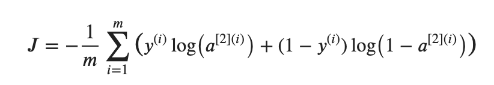
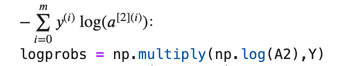
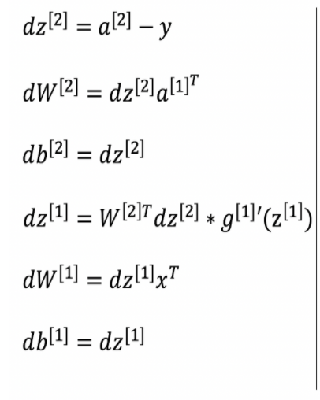
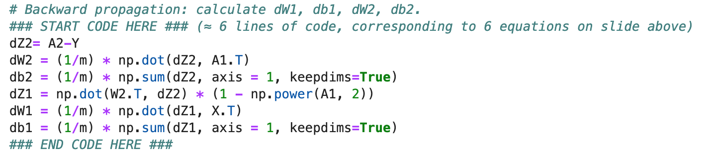

# 과제

## 배경지식

- X 는 2d array 이며 feature는 두개 가지고 있습니다
  - (x1,x2)
- Y 는 1d array 이며 data m개의 label값 (red:0, blue:1) 을 가지고 있습니다.
  - binary classification
- 데이터의 갯수는 400개이다.

### 과정

- initialization - forward propagation - cost 함수 계산 - backward propagation - parameters 업데이트

## layer size 할당

- layer_sizes_test_case 에서 X와 Y를 받아오던데 이건 무엇인가.
- X -- input dataset of shape (input size, number of examples) | (n_x,m)
- Y -- labels of shape (output size, number of examples)
  - 여기서 size라는게 무엇인가? layer의 갯수가 되던데 

## 1. Parameter initialize

- 랜덤하게 initialize 해줍니다.
- 너무 크게 되면 기울기가 0으로 사라지는 경우가 있음 그래서 값을 작게하려고 0.01을 곱해줍니다.

- W1 : (n_h, n_x)
  - n_h : hidden layer 의 unit 갯수
  - n_x : input layer 의 갯수
- W2 : 출력쪽 : (n_y, n_h)
  - n_y : output layer의 갯수 1
  - n_h : output layer 이전의 hidden layer

## 2. Forawrd propagation

- Z1 = np.dot(W1,X) + b1
- A1 = np.tanh(Z1)
- Z2 = np.dot(W2,A1) + b2
- A2 = sigmoid(Z2)

## 3. Cost function 계산

### 예시 

- A2 의 로그값 행렬과 Y행렬을 elementwise 곱 진행.

- 답이 아닙니다.

## 4. Backward propagation

## 5. Update parameters

- W1 = W1 - dW1 * learning_rate
- b1 = b1 - db1 * learning_rate
- W2 = W2 - dW2 * learning_rate
- b2 = b2 - db2 * learning_rate