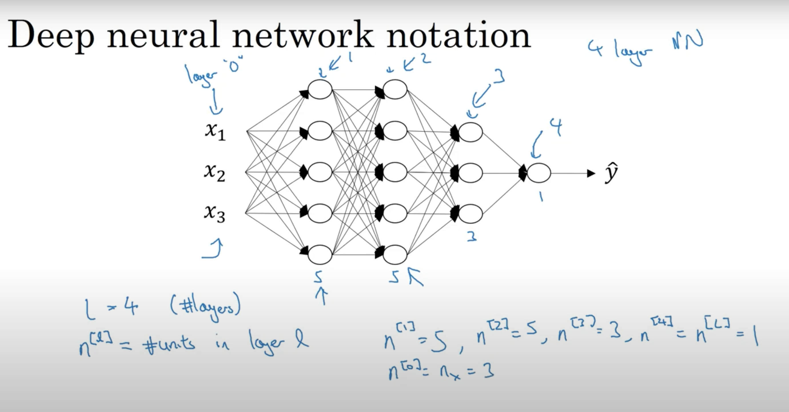

# 5주차 예습

- L : layer 의 갯수 ( input layer는 포함하지 않습니다. )
- n^l : layer 안의 unit 갯수
  - n^0 = input layer 의 unit 갯수가 되고 feature수 n_x와 같다.
  - n^4 = n^L = 1 = output layer 가 된다.

- a^l = activation in layer
- a^l = g^1(z^l)

## C1W4L2

### Forward propagation in a deep network 단일

#### 신경망 1층

- z^1 = w^1 * x + b^1
- a^1 = g^1(z^1)

- x = a^0 와 같은 의미여서 대체 가능
- z^1 = w^1 * a^0 + b^1
  
#### 신경망 2층

- z^2 = w^2 * a^1 + b^2
- a^2 = g^2(z^2)
.
.
.

### Forward propagation in a deep network 백터화된 전체 학습 세트

#### 신경망 1층

- Z^1 = W^1 * A^0 + b^1
- A^1 = g^1(Z^1)
  
#### 신경망 2층

- Z^2 = W^2 * A^1 + b^2
- A^2 = g^2(Z^2)
.
.
.

## C1W4L3

### Debugging (shape 파악)

- W^1 : (n^1,n^0)
- W^l : (n^l,n^(l-1))
  - `n^l 은 layer 안에 갯수!`

- b^l : (n^l, 1)

- dW^l : (n^1,n^0)
  - W와 shape이 같아야함

- db^l : (n^l, 1)
  - b와 shape이 같아야함.

- z^l : g^l(a^l) 이기때문에 a^l과 shape이 같아야함 = 
  - (n^l,1)

### Debugging (백터화된 전체 학습세트)

- Z^1 : W^1 * X + b^1
- Z^1 : (n^1, m)

- Z^l, A^l : (n^l,m)
- dZ^l, dA^l : (n^l,m)

## C1W4L7

### Parameter vs HyperParameter

- Parameter : W,b
- HyperParameter
  - learning late(알파)
  - 은닉층의 갯수
  - 은닉층의 유닛 갯수
  - 활성화 함수 선택

