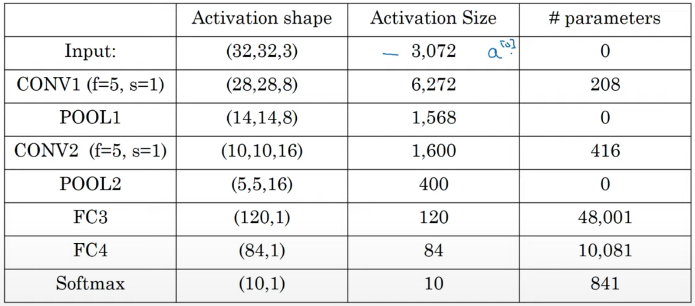
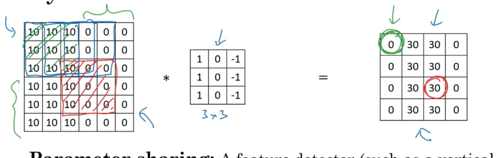

# 8주차 예습

## C4W1L1

### Computer Vision

- 입력이 매우 클수있다는 문제가 있습니다.
- 64pixel 의 컬러 이미지라면 64 x 3 x 64 가되서 x의 크기가 12288 이됩니다.
- 1000pixel 만 되어도 3000000 개의 feature가 존재하게됩니다.

- 이러한 이미지크기를 고민하지 않기위해서는 Convolution operation을 알아야합니다.

## C4W1L2

### Convolutional Neural Networks

- 합성곱 작업은 합성곱 신경망의 핵심 요소입니다.

#### Vertical Edge detection

- 6x6x1 grey scale image 가 있을때

```
3 | 0 | 1 | 2 | 7 | 4
1 | 5 | 8 | 9 | 3 | 1
2 | 7 | 2 | 5 | 1 | 3
0 | 1 | 3 | 1 | 7 | 8
4 | 2 | 1 | 6 | 2 | 8
2 | 4 | 5 | 2 | 3 | 9
```

- 3x3 필터를 만듭니다. (커널이라고도 부릅니다.)

```
1 | 0 | -1
1 | 0 | -1
1 | 0 | -1
```

- 6x6 image와 3x3 을 convolution 시켜줍니다.
- convolution 하면 4x4 이미지가 나옵니다.
- `conv2d` 라는 이름으로 convolution을 구현할수 있습니다.

##### 어떻게 수직을 감지하는가 ?

```
10 | 10 | 10 | 0 | 0 | 0
10 | 10 | 10 | 0 | 0 | 0
10 | 10 | 10 | 0 | 0 | 0
10 | 10 | 10 | 0 | 0 | 0
10 | 10 | 10 | 0 | 0 | 0
10 | 10 | 10 | 0 | 0 | 0
```

- 10이 더 밝은 값이고 0 이 어두운 값으로 10과 0 사이에는 세로 경계선이 생기게 됩니다.

- 여기서 아까 만들었던 3x3 필터를 곱하게 되면

```
0 | 30 | 30 | 0
0 | 30 | 30 | 0
0 | 30 | 30 | 0
0 | 30 | 30 | 0
```

- 다음과 같은 4x4 행렬이 나오는데
- 30이 밝고 0 이 어두운 값입니다.
- 경계선이 밝은 부분이라 생각하면 경계선을 검출 할수있습니다.
- 실제 선보다 좀 굵다고 생각할수있지만 이미지 크기가 커지면 유의미한 결과를 얻을수 있습니다.

## C2W1L3

### More edge detection

```
10 | 10 | 10 | 0 | 0 | 0
10 | 10 | 10 | 0 | 0 | 0
10 | 10 | 10 | 0 | 0 | 0
0  | 0  | 0  | 10| 10| 10
0  | 0  | 0  | 10| 10| 10
0  | 0  | 0  | 10| 10| 10

```

```
1 | 1 | 1
0 | 0 | 0
-1| -1| -1
```

- 위에 행렬을 아래행렬(Horizontal filter)로 필터링 한다면

```
0 | 0 | 0 | 0
30| 10|-10|-30
30| 10|-10|-30
0 | 0 | 0 | 0
```

- 이런 결과가 나오게 됩니다.

#### filter 종류

- sobel

```
1 | 0 | -1
2 | 0 | -2
1 | 0 | -1
```

- scharr

```
3  | 0 | -3
10 | 0 | -10
3  | 0 | -3
```

### filter 선택 할필요x

- filter의 9개의 숫자를 직접 선택할필요 없이 변수로 둡니다.
- 그리고 학습후에 적절한 숫자를 선택하게 만들면 됩니다.

## C2W1L4

### 기존방식

- 가장자리나 모서리에 있는 값은 필터에 거의 걸치지 않아서 상대적으로 적게 사용됩니다.
  - 이미지 가장자리는 거의 버리게 됩니다.
- 지속해서 하게되면 크기가 계속 작아지게 됩니다.

### Padding

- 가장자리에 1픽셀 만큼 더해주는 것입니다.
- 6x6 이미지에서 1픽셀 만큼 더해주면 8x8 이미지가 됩니다.
- 여기서 3x3 필터를 거치게 되면 결과가 6x6 그대로 나오게 됩니다.
- 일반적으로 0을 패딩으로 더해줍니다.

- 가장자리 정보를 덜 가져오는 일을 방지해 줍니다.

#### 패딩을 얼마만큼 할것인가

- filter 값은 거의 홀수 값으로 정해집니다.
  - 3x3 정도가 일반적이고
  - 1x1, 5x5, 7x7 도 쓰인다.

##### valid

- no padding
- `6x6 * 3x3 = 4x4` 라는 예시와 같은것

##### same

- output size가 필터링 하기 전과 같은 size가 나오도록 하는것입니다.

## C4W1L5

### Strided Convolution

- Stride = 2 : filter 박스를 원래는 한칸 옮기게 되는데 2칸 옮기라는 의미입니다.
  - 아래로 내려갈때도 한칸이 아니라 두칸 이동합니다.
- `( (n+2p-f)/s ) + 1` 의 결과행렬크기를 가집니다.

  - 분수가 정수꼴이 아니라면 내림해줍니다.

- 원래는 뒤집는 과정이 convolution 에 있지만 딥러닝에서는 하지않는다
  - 하지만 관습적으로 convolution 이라고 부릅니다.

## C4W1L6

### RGB 이미지 에서의 convolution

- height x width x channels 로 이미지를 표현합니다.
- 하지면 필터를 곱하고 나면 hegiht x width 만 남습니다.

- `6x6x3 * 3x3x3 = 4x4` 이게 됩니다.

### multiple filters

- 두개의 3x3x3 을 6x6x3 에 적용하여서 두개의 4x4 를 얻을수 있습니다.
- 4x4 두개를 겹치게 되면 4x4x2 가 될수있습니다.

## C4W1L7

### one layer of CNN

- 4x4 를 얻었을때 각각에 bias를 더해주어야 합니다.
- 그리고 bias를 더한것에 activation을 해주어야 합니다.
  - `Relu([4x4] + b1)`
  - `Relu([4x4] + b2)`
  - 이것은 4x4x2 가 됩니다.

#### Exercise

- 10개의 3x3x3 크기의 필터 라면
- 그 layer는 몇개의 parameter를 가지게 될까요 ?

  - 한개의 필터는 `27parameters(3x3) + 1parameter(bias)`
  - 10개의 필터니까 280개 입니다.

- `입력이미지의 크기가 1000x1000 이어도 파라미터 수는 280개로 고정입니다.`

- 과대적합을 방지하는 합성곱 신경망의 한 성질입니다.

### summary

- `f^[l]` : `filter size`
- `p^[l]` : `padding`
- `s^[l]` : `stride`
- `n_c^[l]` : `필터의 수 입니다.`
- Input : `n_H^[l-1] x n_W^[l-1] x n_C^[l-1]`
- Output : `n_H^[l] x n_W^[l] x n_C^[l]` = `a^[l]`

- `n_H^[l]` = `([ n_H^[l-1] + 2p^[l] - f^[l] / s^[l] ] + 1)`
- `n_W^[l]` = `([ n_W^[l-1] + 2p^[l] - f^[l] / s^[l] ] + 1)`

- Each filter
  - `f^[l] x f^[l] x n_C^[l-1]`
  - 필터의 채널 수와 입력의 채널수가 일치해야하므로 l-1 입니다.
- Activation
  - `n_H^[l] x n_W^[l] x n_C^[l]` = `a^[l]`
  - `A^[l] = m x a^[l]`
- Weights
  - `f^[l] x f^[l] x n_C^[l]`
- bias
  - `n_C^[l]`
  - `(1,1,1,n_C^[l])`

## C4W1L8

### simple convolution network

#### Example ConvNet

- `의문점 : 그럼 이미지의 중앙에 집중하고 싶으면 어떻게?`
- `초기 input image 에서 padding 을 마이너스 값을 줄수는 없는지 ?`

- [(n+2p-f) / s] + 1

- 39x39x3 에서 다음과 같이 적용합니다.
  - f^[1] = 3
  - s^[1] = 1
  - p^[1] = 0
  - 10개의 필터
- `a^[1]` = 37x37x10 이 나옵니다. 여기서 다음과 같이 적용합니다.
  - f^[2] = 5
  - s^[2] = 2
  - p^[2] = 0
  - 20개의 필터
- `a^[2]` = 17x17x20 이 나옵니다. 여기서 다음과 같이 적용합니다.
  - f^[3] = 5
  - s^[3] = 2
  - 40개의 필터
- 7x7x40 이 나오게 됩니다.
- 지금까지 한일 : 39x39x3 의 이미지를 7x7x40 만큼의 특성을 계산한것
  - 이것을 Flatten 시키면 1960개의 요소가 됩니다.
  - 이것을 로지스틱회귀나 softmax 하게되면 신경망의 최종 예측값이 됩니다.

### ConvNet 종류

- Convolution
- Pooling
- Fully connected

## C4W1L9

### Max Pooling

- Convolution 과 같은 공식으로 크기계산.
- but 채널의 수는 input과 같게 나옵니다.
- 크기가 4x4 라면 풀링크기 2x2로 구역을 나눕니다.

```
1 | 3 | 2 | 1
2 | 9 | 1 | 1
1 | 3 | 2 | 3
5 | 6 | 1 | 2
```

- 좌측 상단 최고값 : 9
- 우측 상단 최고값 : 2
- 좌측 하단 최고값 : 6
- 우측 하단 최고값 : 3

```
9 | 2
6 | 3
```

- 다음과 같이 나타낼수 있습니다.
- 가장 큰수가 어떤 특성을 의미하는 것일수 있습니다.
- 꽤나 잘 작동하지만 이유는 모릅니다.

### Average Pooling

- 잘 사용되지는 않으나 평균을 사용합니다.
- but 신경망의 매우 깊은곳에서는 사용 하고는 합니다.

## C4W1L10

### CNN example

#### 0-9 중에 숫자 판별하기

- LeNet-5 와 흡사합니다.
- 32x32x3 에서 다음과 같이 적용합니다.
  - f = 5
  - s = 1
  - 6개의 필터
- 28x28x6 가 됩니다. [CONV1]에 다음과 같이 적용합니다.
  - f = 2
  - s = 2
  - 높이와 너비를 절반으로 줄어들게합니다.
  - 채널의 수는 유지하게 합니다.
  - pooling
- 14x14x6 가 됩니다. [POOL1] 에 다음과 같이 적용합니다.
  - f = 5
  - s = 1
  - 16개의 필터
- 10x10x16 가 됩니다. [CONV2]에 다음과 같이 적용합니다.
  - f = 2
  - s = 2
  - pooling
- 5x5x16 가 됩니다. [POOL2]

- [CONV1] 과 [POOL1] 을 하나의 [layer1] 로 볼수있습니다.

  - hyper parameter만 존재하고 parameter는 존재하지않음
  - 하지만 2개의 layer로 보는 경우도 있다.

- [CONV2] 와 [POOL2] 를 하나의 [layer2] 로 볼수있습니다.

- POOL2 를 이제 5x5x16 을 Flatten 해서 400개의 요소로 만들어줍니다.
- 400개의 유닛으로 120개의 node를 가진 layer를 만듭니다.
- 그럼 400개의 유닛과 120개의 유닛이 fully connected 됩니다.
- [FC3] 라고 부릅니다. 단일 신경망과 비슷한 형태

- 120개의 유닛과 84개의 유닛을 이어서 [FC4] 를 만듭니다.

- 그리고 10개의 output을 softmax로 계산하면 됩니다.

### 어떻게 하이퍼 파라미터를 정하는가

- 다른사람꺼를 보고 자신에게 맞게 수정

### 형태

- 보통은 아래와 같은 패턴을 띈다
- CONV - POOL - CONV - POOL - Fully Connected - FC - FC - softmax

### Neural network example



## C2W1L11

### Why Convolution

- 변수공유와 희소연결
- 32x32x3 -> 6개의 5x5 필터 = 28x28x6
- 신경망을 형성할 때 3072개를 한층에 두고 4704 에 다 연결하면 1400만개정도 되는데 너무 많다.
- 하지만 합성곱에서는 각 필터는 25개 + 1(bias) = 26 에 6개의 필터면 156개의 parameter
- paramaeter 수가 작게 가지게 됩니다.
- 이동불변성을 포착할수있기때문에 computer vision 분야에 좋음

#### 변수공유

- 각각의 특성검출기 값은 입력이미지의 여러위치에서 동일하게 사용할수있기 때문
- ex )

```
1 | 0 | -1
1 | 0 | -1
1 | 0 | -1
```

#### 희소연결

- 왜 상대적으로 적은 parameter 를 가지는가? (희소연결 때문)
  
- over fitting 도 방지합니다.
